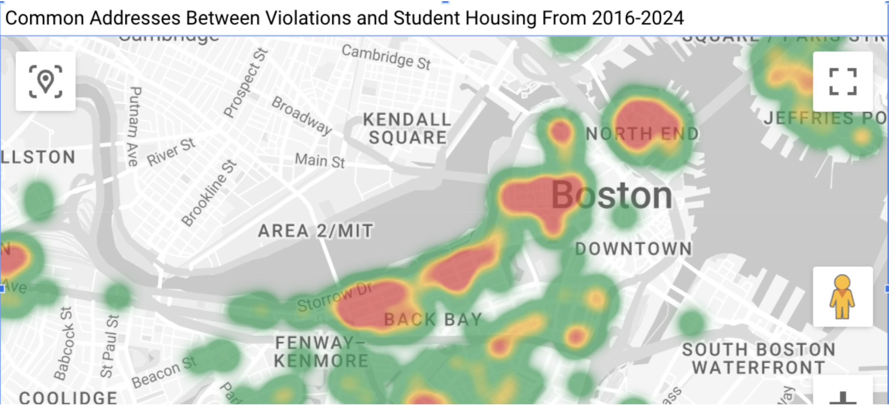
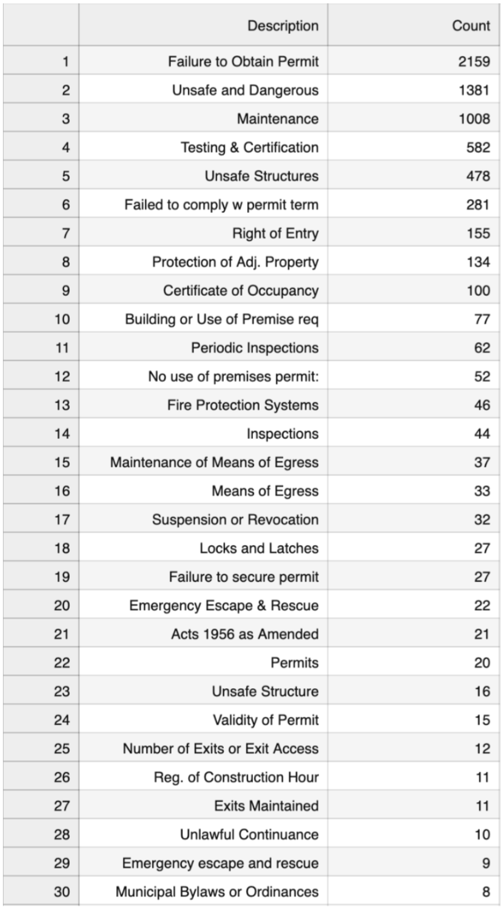
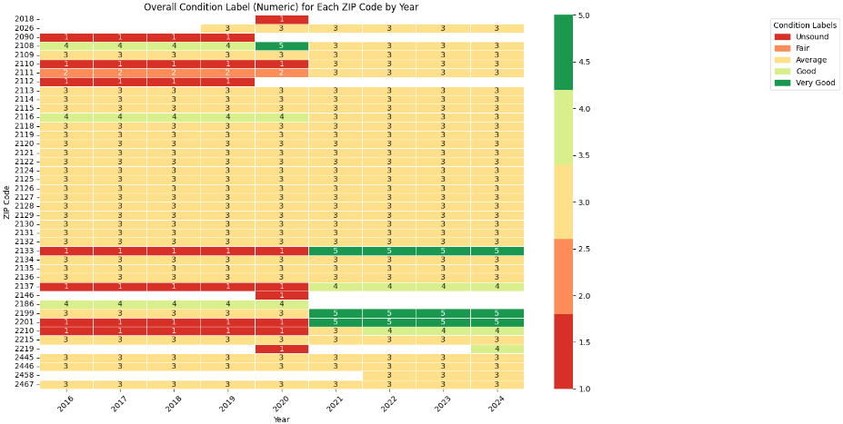
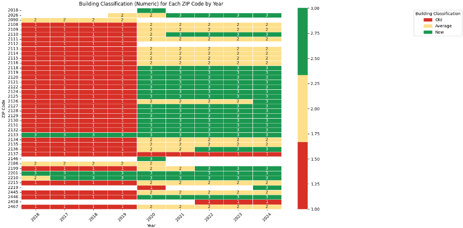
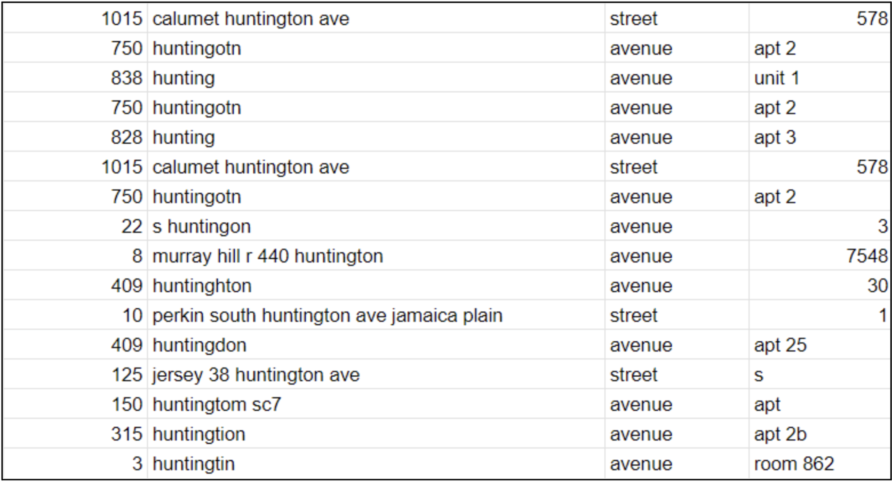
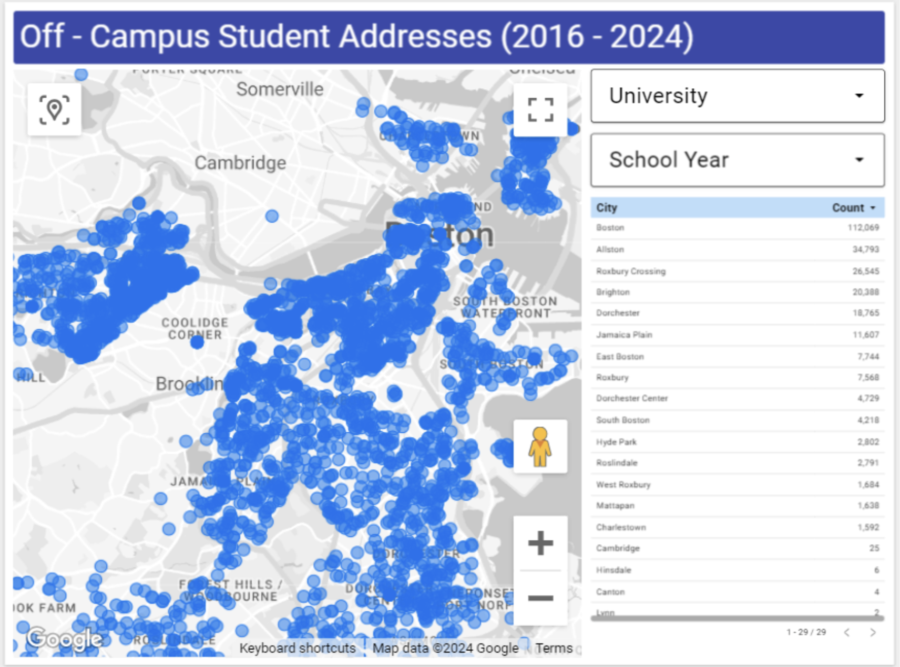
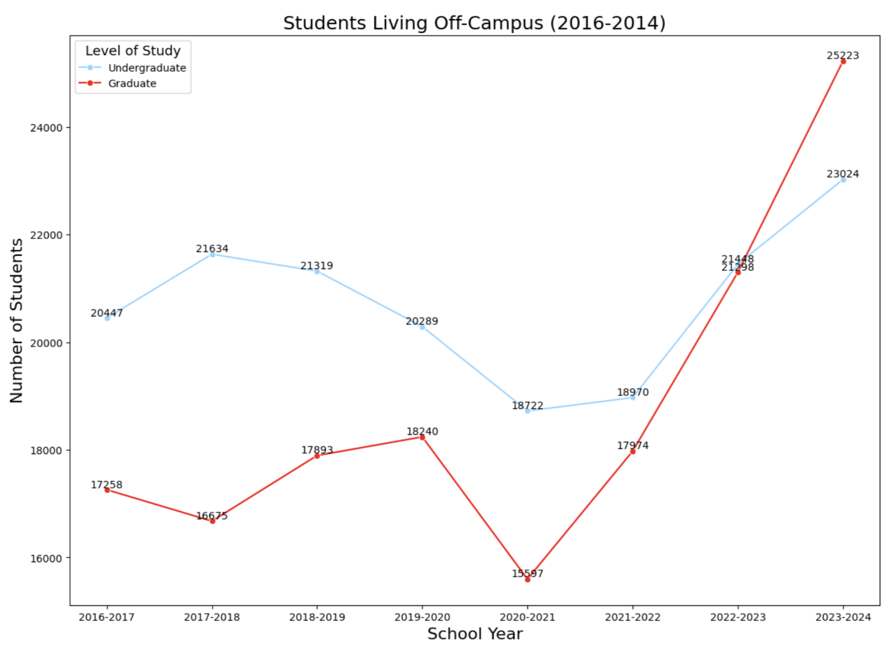
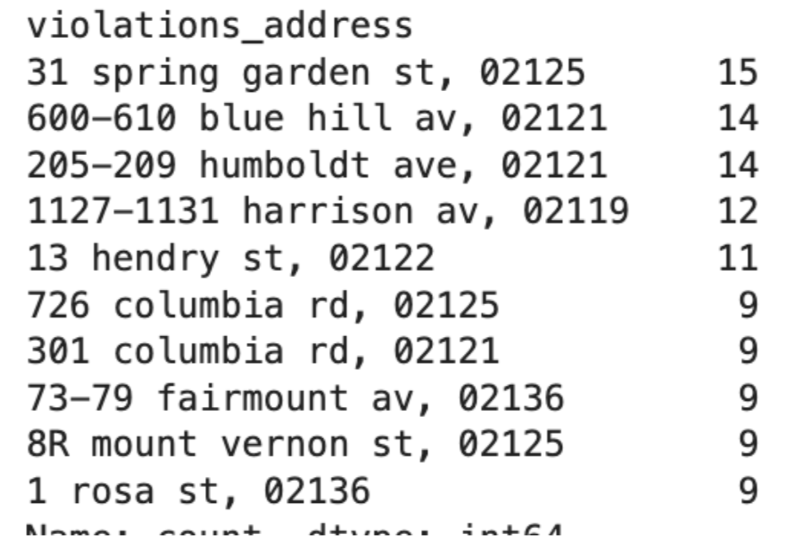

<body>

    
Data Analysis Phase

    
Team B

How to run

Python Version: 3.12.6

If your python version is correct, run the next command:

<code>pip install -r requirements.txt</code>

Now everything is ready, open notebook and it will work

Data Analysis

Midpoint Updates Report

Raul

Dataset: Student Addresses and 311-Service Requests

Tasks:

1. Merged notebooks from previous pull request into 1 full report, additionally added several files explaining the folder structure and how to run the code 
   - Additionally, I revised the cleaning algorithm for the zip codes, to perform better. Removed the address cleaning algorithm due to not being necessary.
2. Starting to build a report on Looker Studio, as requested in the project description preferences. Currently the report has a map visualization of the total amount of students residing off-campus, also, filterable by year-ranges and universities. However, due to looker studio producing a lot of errors, I am currently working on fixing them by fixing the empty zip codes, also potentially finding similar addresses for potential grouping.
   - The link to the report will be provided in the <a href='../README.md'>team's README</a> file.

Future Tasks:

1. Revise this report and all the notebooks to create 1 full notebook report

Christine
Dataset: Building and Properties Violations
Tasks: In cleaning the Building and Properties Violations dataset, the first step was to remove the 'values' column since it was empty for all entries. The focus of the project is on violation addresses, so entries without a violation address were also removed. Since the student housing data provided spans from 2016 to 2024, any dates before 2016 were eliminated to match the project's scope. To improve readability, some entries were converted to title case.

Next, mismatches between the contact_addr1 and contact_addr2 columns were addressed. Sometimes, the violation address appeared in either column, while the company or individual responsible for the building also appeared in both. To standardize this, the violation address was placed in contact_addr1 and the company/person in contact_addr2, which was then renamed to contact_company_or_name. The old contact_addr2 column was replaced with the newly formatted one.

Upon reviewing the new contact_company_or_name column, certain entries, such as specific street names or unit numbers, were incorrectly placed there. These were moved to the contact_address column. Additionally, entries in the contact_address column that included care of (C/O) information were identified and moved to the contact_company_or_name column for proper organization. Finally, the column name violation_sthigh was renamed to violation_stno_range to make it clearer and more descriptive. 

The Building and Properties Violations dataset includes information on all residents in Boston, but our focus is specifically on the violation addresses associated with students. Therefore, the violation addresses were merged with the student addresses and then visualized using Looker Studio.
Findings:
 

List shows top 30 violations out of 215
Map shows most concentrated areas of red in the BU area
Future Tasks: Link SAM-ID to violation/student housing addresses 

Zainab

Dataset: Property Assessment Datasets

This dataset includes property assessment data collected annually from 2016 to 2024, covering multiple ZIP codes. It provides insights into property conditions, building classifications, and other relevant factors critical for urban planning, housing policy, and property management.

Tasks:

1. Data Preparation (2016-2024): Each year’s dataset was individually processed to ensure accuracy. This involved:
   - Cleaning and Standardization: Addressed formatting inconsistencies and standardized condition labels for uniformity.
     - Numerical Mapping: Converted property condition and building classification labels into numeric values for easier analysis and visualization.
       - Yearly Files: Saved each cleaned dataset separately, preserving an annual snapshot of property data for both independent and combined analysis.
2. Data Consolidation: The individual yearly datasets from 2016 to 2024 were merged into a single, unified dataset to allow for longitudinal analysis.
   - Combining Files: All files were combined into one dataset, with ZIP codes formatted consistently.
   - Comprehensive Dataset: This merged dataset provides a complete historical record, enabling the analysis of trends and patterns over time.
3. Data Visualization: Using the consolidated dataset, two heatmaps were created to visualize trends across ZIP codes:
   - Overall Condition Heatmap: Visualized property conditions over time, with a color gradient from "Unsound" (red) to "Very Good" (green), helping to identify areas with stable, improving, or declining conditions.
   - Building Classification Heatmap: Showed trends in building classifications from "Old" (red) to "New" (green), allowing analysis of construction and redevelopment patterns in different ZIP codes.

Findings:
1. Overall Condition Trends:
   - Some ZIP codes, such as 2108 and 2109, consistently displayed "Unsound" or "Fair" conditions, highlighting areas in need of attention.
   - Other ZIP codes, like 2124 and 2128, showed improvement in conditions over time, suggesting successful revitalization efforts.
   - Certain areas maintained high condition ratings, while geographic clustering in ratings indicated possible localized factors influencing conditions.
2. Building Classification Patterns:
   - Many ZIP codes began with older buildings ("Old") but showed transitions to newer classifications by 2024, especially in areas like 2126 and 2130, hinting at urban renewal or increased demand.
   - ZIP codes like 2132 consistently had newer buildings, indicating high-growth areas.
   - Some ZIP codes remained "Old" throughout the years, suggesting limited development or restrictive zoning policies.
3. Insights for Policy and Development:
   - Areas for Intervention: ZIP codes with persistently low conditions and older buildings, such as 2108 and 2109, may benefit from maintenance programs or urban renewal initiatives.
   - Successful Revitalization Models: ZIP codes with improving condition ratings and newer buildings, such as 2124 and 2128, showcase effective revitalization strategies that could be applied elsewhere.
   - Zoning and Development Policies: High-rated areas with newer buildings, like 2132, likely benefit from favorable zoning or incentives, which could be expanded to promote balanced development across more ZIP codes.

Average properties condition per zip code throughout 2016-2024

Average buildings classification per zip code throughout 2016-2024

Future Tasks:

1. Incorporate Additional Factors: Expand analysis to include a broader set of property features, which will enhance understanding of property quality, infrastructure, and amenities.
2. Possible Policy Recommendations: Based on findings, create targeted recommendations to improve maintenance, adjust zoning, or incentivize development where needed.
3. Possible Trend Prediction Models: Leverage historical data to predict future property conditions and classifications, enabling proactive planning and policy decisions.

Gabby 

Dataset: off-campus student addresses

Tasks: 

- Continuing to clean the data:
    - Standardizing format of street suffixes (ex. St → Street, etc.)
    - Correcting misspelled data (ex. “common weallth” → “commonwealth”)
    - Mapping city names to zipcodes, since no city names were given
    - Data is significantly messy due to no standardization in the data collection
        - As of right now, the column “street_name” has ~11k different values due to data either being misspelled or
        - Most of the data has to be cleaned manually

In the screenshot below, here are some examples of the way addresses on Huntington Avenue appear: (which needs further cleaning)

- I am going to look at libraries that are able to string match (i.e. FuzzyWuzzy) to correct Boston street names

- Visualizing data on Looker Studio
  - Plotting addresses on Looker Studio to visualize were students who live off-campus live

- Connecting to other datasets (via SAM ID)
  - Because the data isn’t standardized to be exactly the same as the SAM ID dataset, many of the SAM address IDs cannot be linked to the addresses
    - SAM ID addresses include a range of street numbers to have one SAM ID (ex. “125-131 Park Dr” on SAM ID dataset, whereas addresses on student address dataset are not ranges “125 Park Dr”)
    - Data will need to be changed to fit the same format

Findings: 
- Rapid increase in graduate students living off campus 

Future Tasks and Questions:

1) Have student address data connected to a SAM ID, in order to be linked to other datasets
2) Plot neighborhood boundaries on Looker Studio
3) Why is there such a high increase in graduate students living off-campus?
   - More people are getting graduate degrees? Lack of on-campus housing provided by universities? A combination of different factors? 
4) Create proposals about how data should be collected for the future:
   - Universities should be required to clean (or partially clean) the data they submit to the University Accountability Ordinance. It currently seems like the universities have the students fill out a form about their school year address without double checking to ensure that the address is in the correct format (correct spelling, correct zip code, etc.)

Project’s Questions

1. What are the trends regarding student housing across the city, by district, e.g. what % of the rental housing is taken up by students for each district and how has this changed over time?

2. What are the housing conditions for students living off-campus?
   - Overall Condition Label Heatmap Analysis
     - Trends Over Time: ZIP codes generally maintain consistent condition levels over the years, with many areas rated as “Average” (yellow). However, some ZIP codes exhibit improvement or decline.
     - Deterioration in Condition: ZIP codes such as 2108, 2109, and 2116 frequently appear in darker red tones, indicating "Unsound" or "Fair" conditions, especially in the earlier years (2016-2018). This trend suggests areas where property conditions may need attention due to persistent lower ratings.
     - Improvement in Condition: There are some ZIP codes, such as 2124 and 2128, that show a shift from “Fair” or “Average” to “Good” or “Very Good” (green) by 2024. This trend indicates effective maintenance or revitalization efforts, highlighting areas with positive housing developments.
     - Consistently High Condition Ratings: Certain ZIP codes, such as 2131 and 2132, maintain "Good" or "Very Good" ratings across all years. This consistency suggests stable property conditions, possibly due to regular upkeep and investment in these areas.
     - Geographic Clustering of Conditions: There appears to be a cluster effect, where adjacent ZIP codes (like 2111, 2112, and 2113) share similar condition ratings, indicating possible geographic factors or localized policies that impact property conditions.
   - Building Classification Heatmap Analysis
     - Predominance of Older Buildings: The majority of ZIP codes show buildings classified as "Old" (red) in earlier years (2016-2018). This is particularly evident in ZIP codes such as 2109, 2110, and 2116. The prevalence of older buildings in these areas suggests either a lack of new development or a historical concentration of older structures.
     - Transition to Newer Buildings: Over time, some ZIP codes show a transition from "Old" to "Average" or "New" (yellow and green), particularly around 2126, 2127, and 2130 by 2024. This indicates increased construction or renovation activity, possibly driven by urban renewal efforts or increased demand in these neighborhoods.
     - Consistently Newer Areas: Certain ZIP codes, such as 2132 and 2133, consistently show "New" buildings across multiple years, indicating areas with recent development or frequent redevelopment. These ZIP codes may represent high-growth areas attracting new residential construction.
     - Areas Resistant to Change: Some ZIP codes, particularly 2118 and 2120, remain classified as "Old" throughout the entire period, suggesting limited development or restrictive zoning that discourages new construction.
   - Summary and Insights
     - Areas for Intervention: ZIP codes with consistently low property conditions and older buildings, such as 2108 and 2109, may benefit from targeted maintenance programs, incentives for property improvements, or urban renewal initiatives.
     - Successful Revitalization Efforts: ZIP codes showing an improvement in both condition ratings and building classifications, such as 2124 and 2128, can serve as models for successful revitalization, possibly due to investment or policy initiatives that encourage property upgrades and new construction.
     - Zoning and Development Policies: Areas with consistently high ratings and newer buildings (e.g., 2132) likely benefit from favorable zoning laws or development incentives, making them attractive for new projects. Policymakers could consider extending similar incentives to other ZIP codes in need of revitalization.
3. What is the spectrum of violations and severity in regards to worst landlords classifications?
   - The spectrum of violations in regards to worst landlords classifications reveals a range of issues varying in severity. The most frequent violation landlords encounter is the failure to obtain necessary permits, which is considered a less severe issue. This type of violation typically indicates negligence in administrative processes rather than posing an immediate threat to tenant safety. In contrast, the second most common violation involves properties being deemed unsafe or dangerous. This represents a more severe violation, raising significant concerns about the safety and well-being of tenants, particularly vulnerable populations such as students. Overall, this classification underscores a spectrum where some issues primarily reflect regulatory noncompliance, while others pose direct risks to tenant safety.
4. What landlords are non-compliant? Overall volume, severe violations
   - 
   - Based on the top 10 violation addresses, the associated neighborhoods in Boston can be summarized as follows: Dorchester has one address, 13 Hendry St, 02122; Roxbury also has one address, 1127-1131 Harrison Ave, 02119. West Roxbury features two addresses, 73-79 Fairmount Ave, 02136 and 1 Rosa St, 02136. Additionally, six addresses fall within other areas of Boston, including 31 Spring Garden St, 02125, 600-610 Blue Hill Ave, 02121, 205-209 Humboldt Ave, 02121, 726 Columbia Rd, 02125, 301 Columbia Rd, 02121, and 8R Mount Vernon St, 02125. Overall, the violations are distributed across multiple neighborhoods, with the majority located in broader regions of Boston.