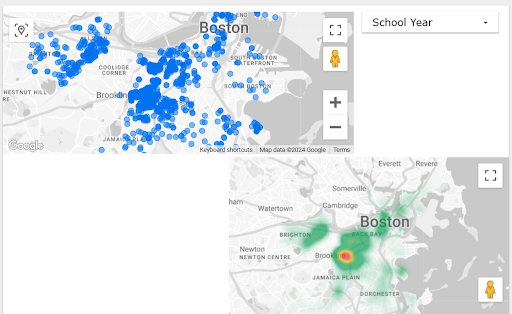

<body>

    
Data Preparation Phase

    
Team B

Data Collection and Cleaning

Data was collected from the shared drive, we were told to work with only files that begin from 2016 Fall Semester to the end of 2024 Spring Semester. These reports are also made for several universities per year range. Totalling in around 220 files.

We decided to split the merging into several tasks for everybody at first because a large enough part of the data was not under the same format, so we had to get that fixed first. Every member took an equal part of data to fix, which also helped us do it quicker. After fixing and merging the files in their group, we merged all groups into 1. The dataset contains all of the student addresses, given they lived off-campus, throughout the years since the 2016th Fall Semester. Final file contains arround 290 thousand entries.

Then, we switched to cleaning, we decided to split the cleaning into two parts and assigning each part to a different member of a team, whilst the other group inspected other datasets in the project description to possibly find a connection between 2. 

The first part of cleaning is to fix the addresses, the issue was that, the format for address was prepicked for most of them, which was <code>street_number, street_name, street_suffix, unit_number</code>, but some were under format where the whole address was written in a span of 1 column, rather than 4. So we had to split the addresses, splitting by spaces didn't work since it would cost us a lot of data points, therefore, we had to design an algorithm for doing it as accurately as possible. The code for the final algorithm will be on Github in branch 

The second part of cleaning was to work on categorical columns. The issue was, that for most categorical columns in the given format should've been one of two variants they given, they actually had many more, where some of the different variants, caused a different issue. So, we started by looking through each column, starting with <code>zip_code</code>, most of them were fine, however, some were under different formatting, so we fixed that. Then we worked on <code>at_home</code> and <code>extra_large_column</code>, they also had a lot of different values so we just mapped the values into a domain of 3 values. However, two columns <code>level_of_study</code> and <code>full_time</code> were in a worse of state than others. While inspecting the data we realized that some rows had values such as <code>3 UG; 5 G</code> or <code>all FT</code> for some rows. Which actually meant 8 students residing on the same addres, 5 of them being graduates, and the other 3 undergraduates, all studying full-time. This issue appeared in a few thousand entries, which we didn't want to lose so we fixed that. 

Right now we are still looking for the connections between datasets, but we did find a few already, and started cleaning the ones we found. 

However, skimming over a data we hope to try to build neighborhood ranking and house ranking to try to track changes in off-campus student housing. Possibly identifying any correlations and visualizing them to analyze. 

<i>Notebook for merging:</i> <a href="fa24-team-b/data_prep_phase/data_prep.ipynb"><code>fa24-team-b/data_prep_phase/data_prep.ipynb</code></a>

<i>Script for address_parser:</i> <a href="fa24-team-b/data_prep_phase/address_parser.py"><code>fa24-team-b/data_prep_phase/address_parser.py</code></a>

<i>Notebook for data cleaning:</i> <a href="fa24-team-b/data_prep_phase/merge_and_clean.ipynb"><code>fa24-team-b/data_prep_phase/merge_and_clean.ipynb</code></a>

Workload

<ul style="font-size:20px; font-weight: 400">
    <li>
        
Raul

        <ol style="font-size: 16px; font-weight: 200;">
            <li>
                Inspecting the initial dataset and merging a subgroup of the full dataset.
            </li>
            <li>
                Writing an algorithm for address parsing and applying it on addresses that were not separated
            </li>
            <li>
                Cleaning the rest of the merged dataset.
            </li>
        </ol>
    </li>
    <li>
        
Zainab

        <ol style="font-size: 16px; font-weight: 200;">
            <li>
                Inspecting the data, cleaning the data, and developing code to merge all the clean data of all schools. 
            </li>
            <li>
                Inspecting “Property Assessment” datasets and looking for possible ways to connect it to the main student addresses dataset.
            </li>
            <li>
                Started cleaning 2024 Property Assessment dataset.
            </li>
        </ol>
    </li>
    <li>
        
Christine

        <ol style="font-size: 16px; font-weight: 200;">
            <li>
                Inspecting the dataset and merging a part of the data into a group.
            </li>
            <li>
                Inspecting other datasets for possible connections to the main one. 
            </li>
            <li>
                Started the cleaning of the building and property violations dataset.
            </li>
        </ol>
    </li>
    <li>
        
Gabby

        <ol style="font-size: 16px; font-weight: 200;">
            <li>
                Inspecting the dataset, cleaning the data and merging each year of the dataset into a dataset, grouped by school. 
            </li>
            <li>
                Below is an example of visualization of student addresses for one of the Boston schools (Wentworth Institute of Technology)
                 
                </img>
            </li>
        </ol>
    </li>

    
</body>